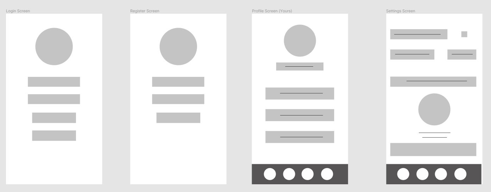
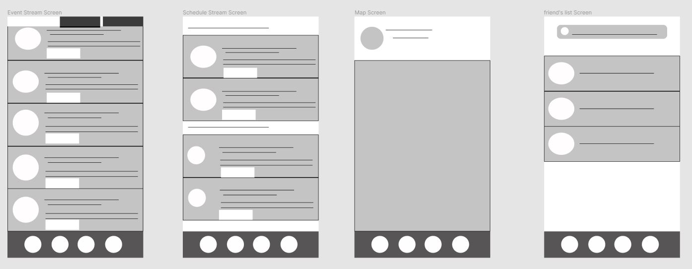
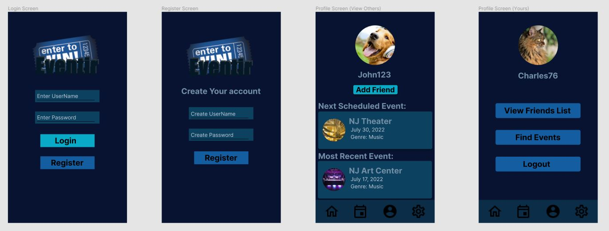
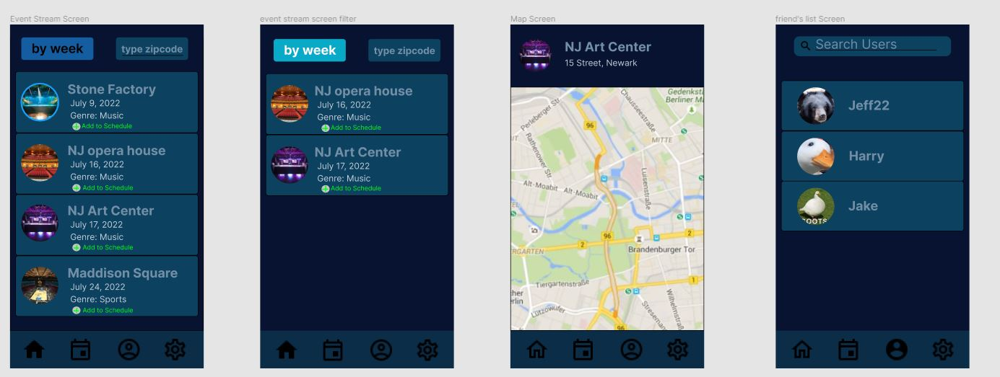
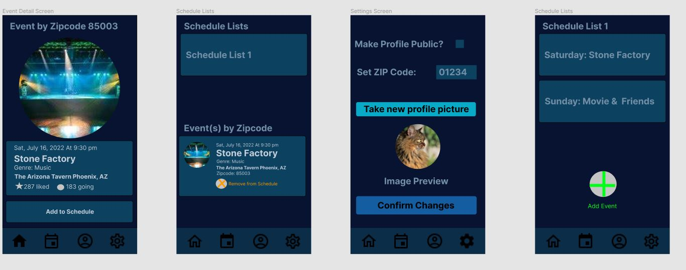

# Eventir

## Table of Contents
1. [Overview](#Overview)
1. [Product Spec](#Product-Spec)
1. [Wireframes](#Wireframes)
2. [Schema](#Schema)
4. [Milestone-1](#Milestone-1)

## Overview
### Description
Eventir is an app that lets users create profiles, add events to their schedule, see other events in their area, and see what events their friends are attending.

### App Evaluation
- **Category: Social Media/Lifestyle**
- **Mobile: It is more convenient for the user to access this on their phone in order to view their schedule at a glance, as well as have reminders for what's next in their day.**
- **Story: allows users to view apps in their area by zipcode. and connect with friends to see the events that interest them. Through friends users can find new events to attend.**
- **Market: This is being marketed to users who want a one-stop palce for users to plan events, explore other events within the same genre, and see what similar events other users have gone to.**
- **Habit: Weekly**
- **Scope: User should be able to create/login to their profile, view events in their area, and plan events.**

## Product Spec

### 1. User Stories (Required and Optional)

**Required Must-have Stories**

* User can create an account/login to their account
* User can view local events (Eventbrite API/Ticketmaster API, Google Maps API)
* User can view what events they have planned
* User can add new events to their schedule (Eventbrite API/TicketMaster API)
* User can click on an event to view detailed information (Eventbrite API/Ticketmaster API)
* User can change their account settings
* User can add friends/view their friends' profiles

**Optional Nice-to-have Stories**

* Detailed view links to the artist's music usic Spotify
* Filtered search for events (search events by genre, location, etc.)
* User can post comments about an event they attended to their profile

### 2. Screen Archetypes

* Login Screen
   * User can create an account/login to their account
* Registration Screen
   * User can create an account/login to their account
* Stream
   * User can view local events
* Detailed View
   * User can view what events they have planned
* Detailed View
   * User can click an event to view detailed information
* Profile
   * User can view their own/their friends' profile
* Settings
   * User can change their account settings

### 3. Navigation

**Tab Navigation** (Tab to Screen)

* Event stream screen tab.
* Profile tab.
* Settings tab.
* Event schedule tab.

**Flow Navigation** (Screen to Screen)

* click on event on stream screen/schedule screen/friend's profile.
   * goes to detail view of event.
* click on friend in friends list screen
   * goes to friend's profile.
* click on View Friends List button in profile screen.
   * goes to friends list screen
* click on Find Events button in Profile screen
   * goes to event stream screen
* click on Register button on in Login screen.
   * goes to registration screen
* click on Register button in Registration screen
   * goes to login screen
* click on logout in profile screen
   * goes to login screen
* click on login on login screen.
   * goes to schedule screen.
* click on event's location in event detail view
   * goes to map screen
* click on a schedule list in the schedule lists screen
   * goes to the screen for that schedule list

## Wireframes
[Add picture of your hand sketched wireframes in this section]

link to figma file containing wireframes https://www.figma.com/file/aa8yCe7yaNZsqETiwXledP/Low-Fidelity?node-id=0%3A1.

### [BONUS] Digital Wireframes & Mockups

link to figma file containing mockups https://www.figma.com/file/bEEWBn9xFFqGLcfBX5fRyQ/High-fidelity?node-id=0%3A1.

### [BONUS] Interactive Prototype

## Schema 
[This section will be completed in Unit 9]
### Models
User:

| Property | Type | Description |
| :---    | :-- |  :---      |
| objectId | String | Unique ID for each user (default field) |
| username | String | User’s public display name |
| password | String | Password used for this user to login |
| profilePicture | File |User’s profile picture |
| zipCode | String | User’s ZIP code |
| visibility | Boolean | Denotes whether or not user’s profile is visible to others (0 = private, 1 = public) |
| schedule | Pointer to Schedule Object | List of events that the User has currently added to their schedule |
| friendList | Array of Pointers to User objects | List of users that this User has added as a friend |

Event:

| Property | Type | Description |
| :---    | :-- |  :---      |
| objectId | String | Unique ID for each event (default field) |
| location | String | The address where the event takes place |
| genre | String | What type of event this is |
| image | File | Image that previews the event |
| venue | String | The venue that the event will be held at |
| date | Date | The date that the event takes place |

Schedule:

| Property | Type | Description |
| :---    | :-- |  :---      |
| objectID | String | Unique ID for each schedule a user has |
| scheduleName | String | User-decided name for the schedule |
| ownerID | Pointer to User object | Points to the ID of the User that owns this schedule |
| events | Array of Pointers to Event objects | The list of all the events in the schedule |

### Networking
**Profile Screen:**

(Read/GET) Query logged in User object

**Settings Screen:**

(Read/GET) Query logged in User object

(Update/PUT) Update User's privacy setting

(Update/PUT) Update User's ZIP code

(Update/PUT) Update User's Profile image

**View Others' Profile Screen:**

(Read/GET) Query clicked on User object

(Update/PUT) (When added as friend) Update logged in User's friends list with the queried User

(Read/GET) Query the most recent event in the User's schedule where event date is less than current date

(Read/GET) Query the next event in the User's schedule where event date is greater than current date

**Registration Screen:**

(Create/POST) Create a new User object

**Friends List Screen:**

(Read/GET) Query all Users in logged in User's friends list

(Read/GET) (Search Users Bar) Query all Users where username = typed in username

**Event Feed Screen:**

(Create/POST) When button for adding an event is clicked it creates a new row in the events table with selected event linked to current user by their username.

**Event Detail Screen:**

(Read/GET) Query the event's address to open in maps screen

### [OPTIONAL:] Existing API Endpoints
##### TicketMaster API
- Base URL - [https://app.ticketmaster.com/discovery/v2](https://app.ticketmaster.com/discovery/v2)

   HTTP Verb | Endpoint | Parameters | Description
   ----------|----------|-------------|------------
    `GET`    | /events | postalCode, radius, unit | Finds events and filters your search
    
    ## Milestone-1
    
 **completed user stories**
 
[x] User can view events. 

[x] User can create/login to their account.

[x] User can view what events they have planned.
    
here is a walkthrough of the completed stories.

    
    
    

